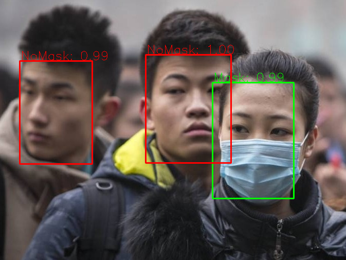

<!-- # FaceMaskDetection
[中文版](README-zh.md)

### We open source all the popular deep learning frameworks' model and inference code to do face mask detection.

 - [x] PyTorch
- [x] TensorFlow（include tflite and pb model）
- [x] Keras
- [x] MXNet
- [x] Caffe


** Detect faces and determine whether they are  wearing mask. **


** First of all, we hope the people in the world defeat COVID-2019 as soon as possible. Stay strong, all the countries in the world.**


* We make face mask detection models with five mainstream deep learning frameworks （PyTorch、TensorFlow、Keras、MXNet和caffe） open sourced, and the corresponding inference codes. 

* We published 7959 images to train the models. The dataset is composed of [WIDER Face](http://shuoyang1213.me/WIDERFACE/) and [MAFA](http://www.escience.cn/people/geshiming/mafa.html), we verified some wrong annotations.  You can download here from [Google drive](https://drive.google.com/file/d/1QspxOJMDf_rAWVV7AU_Nc0rjo1_EPEDW/view?usp=sharing), if you can not visit Google, you can download it from BaiduDisk, click [here to know how to download](README-zh.md).





We deployed a web page, you can click the link to experience it.
The page is writen by Tensorflow.js.

[AIZOO face mask detection](https://demo.aizoo.com/face-mask-detection.html)
## Model structure

We used the structure of SSD. However,  in order to  make it run quickly in the browser, the backbone network is lite. The total model only has 1.01M parametes.

Input size of the model is 260x260, the backbone network only has 8 conv layers. The total model has only 24 layers with the  location and classification layers counted.

SSD anchor configurtion is show bellow:

| multibox layers | feature map size | anchor size | aspect ratio）|
| ---- | ---- | ---- | ---- |
|First|33x33|0.04,0.056|1,0.62,0.42|
Second ||17x17|0.08,0.11|1,0.62,0.42|
|Third|9x9|0.16,0.22|1,0.62,0.42|
|Forth |5x5|0.32,0.45|1,0.62,0.42|
|Fifth|3x3|0.64,0.72|1,0.62,0.42|

## How to run
### pytorch
on image：
```
python pytorch_infer.py  --img-path /path/to/your/img
```
on video：
```
python pytorch_infer.py --img-mode 0 --video-path /path/to/video  
# If you want to run with camera video, set  video_path to be 0
python pytorch_infer.py --img-mode 0 --video-path 0
```
### TensorFlow/Keras/MXNet/Caffe
The other four frameworks running method is similar to pytorch, just replace `pytorch`with `tensorflow`, `keras`,`caffe`，`mxnet`,
if you want to use tensorflow, just run:
```
python tensorflow_infer.py  --img-path /path/to/your/img
```
**Attention，for caffe's inference ，we use permute layer，so that we should use [caffe-ssd](https://github.com/weiliu89/caffe/tree/ssd)**，you can use opencv-dnn to do the inference.
## Appendix
### Feedback
If you use wechat, you can follow us.


### Model structure

We merge the BN to Conv layers in order to accelerate the inference speed.


### Testset PR curve


### Our demo page

[aizoo.com face mask detection demo](https://demo.aizoo.com/face-mask-detection.html)


 -->